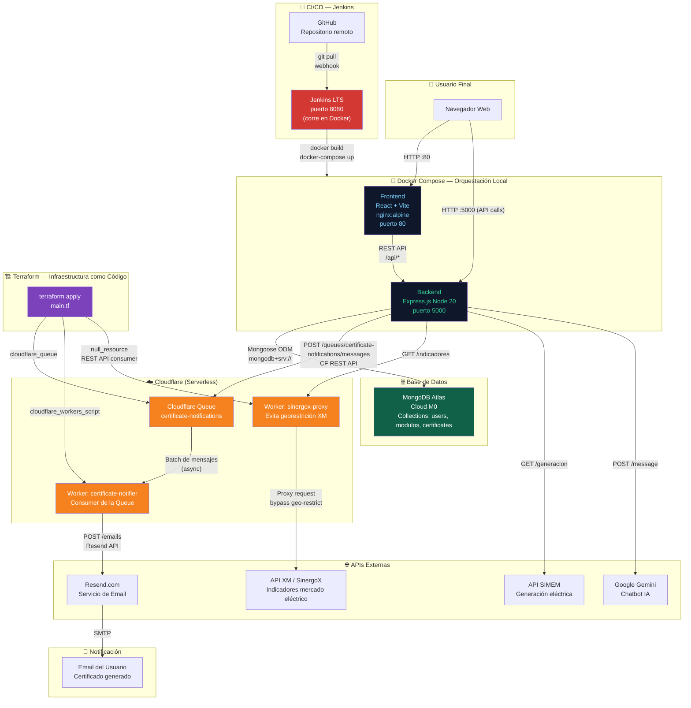
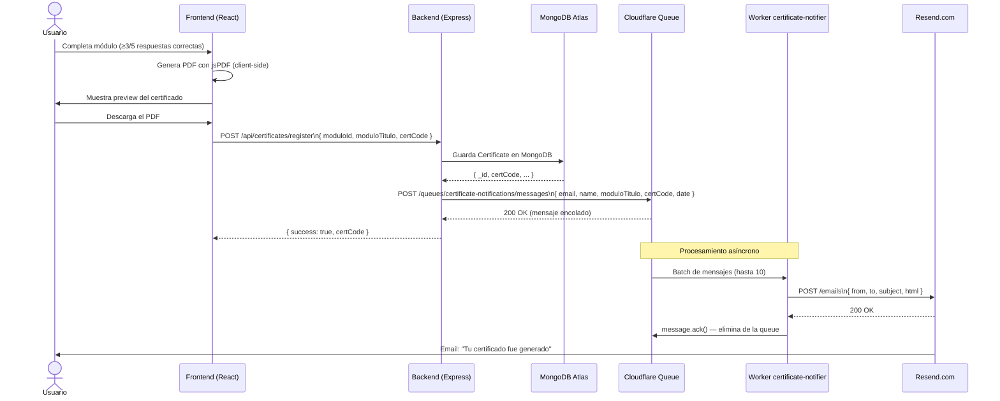

# ⚡ Energía Clara — Arquitectura de Microservicios

Plataforma educativa sobre energías renovables en Colombia (Tecnológico de Antioquia — TDEA), implementada con arquitectura de microservicios, containerización Docker, CI/CD con Jenkins, infraestructura como código con Terraform y mensajería en la nube con Cloudflare Queues.

---

## 📐 Diagrama General de Arquitectura



---

## 🔄 Flujo Completo: Generación de Certificado



---

## 🏗️ Pipeline CI/CD con Jenkins

```mermaid
graph LR
    Dev["💻 Developer\ngit push"] -->|"push a main"| GH["GitHub\nproyecto_final_desarrollo"]
    GH -->|"Build Now\no webhook"| J["Jenkins\nlocalhost:8080"]

    J --> S1["Stage: Checkout\nclona el repo"]
    S1 --> S2["Stage: Build Images\n(paralelo)"]

    S2 --> F["docker build\nenergia-clara-frontend"]
    S2 --> B["docker build\nenergia-clara-backend\n(incluye Playwright+Chromium)"]

    F --> S3["Stage: Deploy"]
    B --> S3

    S3 --> D1["Copia server/.env\ndesde Jenkins Credentials"]
    D1 --> D2["docker-compose down\n--remove-orphans"]
    D2 --> D3["docker-compose up -d\n(levanta frontend + backend)"]

    D3 --> S4["Stage: Health Check\ndocker exec backend\ncurl /api/health"]

    S4 -->|"✅ 200 OK"| OK["Pipeline Verde\nApp desplegada"]
    S4 -->|"❌ Error"| FAIL["Pipeline Rojo\ndocker-compose logs"]

    style OK fill:#116149,color:#fff
    style FAIL fill:#d33833,color:#fff
```



---

## 🧩 Componentes del Sistema

### 1. 🖥️ Frontend — React SPA
| Detalle | Valor |
|---|---|
| Framework | React 19 + Vite 7 |
| Estilos | Tailwind CSS v4 |
| Animaciones | Anime.js v4 |
| Certificados | jsPDF v3 (generación client-side) |
| Contenedor | `nginx:alpine` (puerto 80) |
| Imagen Docker | `energia-clara-frontend:latest` |

**Responsabilidad:** Servir la interfaz de usuario. Cada ruta es un componente React independiente. Los certificados se generan completamente en el navegador del usuario (sin carga en el servidor).

---

### 2. ⚙️ Backend — API REST
| Detalle | Valor |
|---|---|
| Framework | Express.js 4 |
| Runtime | Node.js 20 (Debian Bookworm) |
| Base de datos | MongoDB via Mongoose 8 |
| Autenticación | Energy Community Auth SDK + JWT |
| Scraping | Playwright (dinámico) + Cheerio (estático) |
| Chatbot | Google Gemini 2.5 Flash |
| Contenedor | `node:20-bookworm` (puerto 5000) |
| Imagen Docker | `energia-clara-backend:latest` |

**Endpoints principales:**

| Ruta | Método | Descripción |
|---|---|---|
| `/api/auth/*` | POST | Login, registro, refresh token |
| `/api/educativo/modulos` | GET | Lista módulos (pública) |
| `/api/educativo/modulos/:id` | GET | Módulo completo + respuestas (protegida) |
| `/api/certificates/register` | POST | Registra certificado + publica en Queue |
| `/api/chatbot/message` | POST | Consulta a Gemini |
| `/api/noticias` | GET | Noticias scrapeadas |
| `/api/simem/generacion` | GET | Datos SIMEM |
| `/api/sinergox/indicadores` | GET | Indicadores XM via Worker |
| `/api/health` | GET | Estado del servidor |

---

### 3. 🗄️ Base de Datos — MongoDB Atlas
| Detalle | Valor |
|---|---|
| Proveedor | MongoDB Atlas (Cloud) |
| Plan | M0 Sandbox (512 MB, gratuito) |
| ODM | Mongoose 8 |
| Colecciones | `users`, `modulos`, `certificates` |

**Colección `certificates`** (nueva — creada para este proyecto):
```json
{
  "userId": "sdk-user-id",
  "userEmail": "usuario@email.com",
  "userName": "Edwin Velásquez",
  "moduloId": "transicion-energetica",
  "moduloTitulo": "Transición Energética",
  "certCode": "EC-M3X2K1-ED",
  "generatedAt": "2026-05-14T23:00:00Z"
}
```

---

### 4. ☁️ Cloudflare Workers — Serverless

#### Worker 1: `sinergox-proxy`
- **URL:** `https://sinergox-proxy.velasquezgiraldoedwin.workers.dev`
- **Problema que resuelve:** La API de XM (`servapibi.xm.com.co`) bloquea requests desde IPs fuera de Colombia. Al desplegarla en Cloudflare (que sí tiene IPs colombianas en sus edge nodes), el backend puede acceder a los datos del mercado eléctrico sin restricción.
- **Función:** Proxy transparente — recibe la request del backend y la reenvía a XM, devolviendo la respuesta con headers CORS correctos.

#### Worker 2: `certificate-notifier`
- **Trigger:** Cloudflare Queue (Consumer)
- **Función:** Recibe mensajes de la queue `certificate-notifications`, construye un email HTML y lo envía via API de Resend.
- **Variables de entorno:** `RESEND_API_KEY` (secret del Worker)

---

### 5. 📨 Cloudflare Queues — Mensajería Asíncrona
| Detalle | Valor |
|---|---|
| Queue | `certificate-notifications` |
| Plan | Workers Free (10,000 ops/día gratis) |
| Retención | 24 horas |
| Batch size | 10 mensajes |
| Max retries | 3 intentos |

**¿Por qué Queues y no llamar el email directamente?**
- **Desacoplamiento:** El backend no depende de que Resend esté disponible en el momento exacto.
- **Resiliencia:** Si el email falla, la Queue reintenta automáticamente hasta 3 veces.
- **Rendimiento:** El backend responde al usuario instantáneamente sin esperar el envío del email.

---

### 6. 🤖 Jenkins — Automatización CI/CD
| Detalle | Valor |
|---|---|
| Versión | Jenkins LTS |
| Despliegue | Docker (`jenkins/jenkins:lts`) |
| Puerto | 8080 |
| Fuente del pipeline | `Jenkinsfile` en el repo |

**Etapas del pipeline:**
1. **Checkout** — Clona el código desde GitHub
2. **Build Images** *(paralelo)* — Construye las imágenes Docker del frontend y backend simultáneamente
3. **Deploy** — Copia el `.env` desde Credentials, baja contenedores viejos y levanta los nuevos con `docker-compose`
4. **Health Check** — Verifica que el backend responde en `/api/health`

**Ventaja clave:** Con un solo `git push`, todo el proceso de construcción y despliegue es automático y repetible. Elimina el error humano en despliegues manuales.

---

### 7. 🏗️ Terraform — Infraestructura como Código
| Detalle | Valor |
|---|---|
| Provider | `cloudflare/cloudflare ~> 4` |
| Versión Terraform | v1.15.3 |
| Recursos gestionados | Queue + Worker + Consumer binding |

**Recursos que gestiona `main.tf`:**

```hcl
cloudflare_queue           "certificate_notifications"  # La Queue
cloudflare_workers_script  "certificate_notifier"       # El Worker consumer
null_resource              "register_queue_consumer"    # Vincula Worker ↔ Queue
```

**Ventaja del IaC:** La infraestructura está documentada en código versionado en Git. Para recrear todo el entorno de Cloudflare desde cero basta con `terraform apply`.

---

## 📁 Estructura del Proyecto

```
FINAL_ELECTIVA/
│
├── client/                          # Microservicio Frontend
│   ├── src/
│   │   ├── components/              # 19 componentes React
│   │   │   └── ModuloEducativo.jsx  # Generación de certificados PDF
│   │   ├── services/authService.js  # Manejo de JWT
│   │   └── api.js                   # URL base del backend
│   ├── Dockerfile                   # Multi-stage: Node build + nginx serve
│   ├── nginx.conf                   # Config SPA (try_files → index.html)
│   └── .dockerignore
│
├── server/                          # Microservicio Backend
│   ├── routes/
│   │   ├── auth.js                  # Autenticación JWT
│   │   ├── certificates.js          # ★ NUEVO: registro + Cloudflare Queue
│   │   ├── educativo.js             # Módulos educativos
│   │   ├── chatbot.js               # Gemini AI
│   │   ├── noticias.js              # Web scraping
│   │   ├── simem.js                 # API SIMEM
│   │   └── sinergox.js              # Indicadores XM
│   ├── models/
│   │   ├── User.js
│   │   ├── Modulo.js
│   │   └── Certificate.js           # ★ NUEVO: modelo de certificados
│   ├── middleware/auth.js            # Validación de tokens
│   ├── Dockerfile                   # Node 20 Bookworm + Playwright
│   └── .dockerignore
│
├── workers/                         # Funciones Serverless Cloudflare
│   └── certificate-notifier.js      # ★ NUEVO: consumer Queue → email
│
├── terraform/                       # Infraestructura como Código
│   ├── main.tf                      # Queue + Workers + Consumer binding
│   ├── variables.tf                 # Variables (account_id, api_token, etc.)
│   ├── outputs.tf                   # Outputs: queue_name, worker_name
│   └── terraform.tfvars             # ⚠️ Secretos — NO subir a Git
│
├── docker-compose.yml               # Orquestación: frontend + backend
├── Jenkinsfile                      # Pipeline CI/CD (4 etapas)
├── .gitignore                       # Excluye .env, terraform.tfvars, etc.
└── README.md                        # Este archivo
```

---

## 🛠️ Stack Tecnológico Completo

| Capa | Tecnología | Versión | Rol |
|---|---|---|---|
| Frontend | React | 19.1 | UI componentes |
| Frontend | Vite | 7.1 | Build tool |
| Frontend | Tailwind CSS | 4.x | Estilos |
| Frontend | jsPDF | 3.0 | Generación PDF |
| Frontend | nginx | alpine | Servidor web |
| Backend | Node.js | 20 LTS | Runtime |
| Backend | Express.js | 4.18 | Framework API REST |
| Backend | Mongoose | 8.0 | ODM MongoDB |
| Backend | Playwright | 1.58 | Web scraping dinámico |
| Backend | Cheerio | 1.2 | Web scraping estático |
| Backend | Nodemailer | 8.0 | Email reset contraseña |
| Base de Datos | MongoDB Atlas | M0 | Persistencia cloud |
| Serverless | Cloudflare Workers | — | Funciones edge |
| Mensajería | Cloudflare Queues | — | Cola asíncrona |
| Email | Resend.com | API v1 | Envío transaccional |
| Contenedores | Docker | — | Containerización |
| Orquestación | Docker Compose | v2 | Multi-container |
| CI/CD | Jenkins | LTS | Automatización |
| IaC | Terraform | 1.15 | Infraestructura como código |
| IA | Google Gemini | 2.5 Flash | Chatbot |

---

## 🚀 Cómo Levantar el Sistema

### Primera vez (setup completo)

#### 1. Clonar el repositorio
```bash
git clone https://github.com/edwinvg99/proyecto_final_desarrollo.git
cd proyecto_final_desarrollo
```

#### 2. Configurar variables de entorno
Crear `server/.env` con:
```env
MONGO_URI=mongodb+srv://...
GEMINI_API_KEY=...
AUTH_SDK_API_KEY=...
EMAIL_USER=...
EMAIL_PASS=...
RESEND_API_KEY=...
CF_API_TOKEN=...
CF_ACCOUNT_ID=...
CF_QUEUE_NAME=certificate-notifications
FRONTEND_URL=http://localhost
PORT=5000
```

#### 3. Provisionar infraestructura Cloudflare con Terraform
```bash
cd terraform

# Crear terraform.tfvars (NO subir a Git)
# cloudflare_api_token  = "..."
# cloudflare_account_id = "..."
# resend_api_key        = "..."

terraform init
terraform plan
terraform apply   # Escribe "yes" para confirmar
cd ..
```

#### 4. Construir y levantar con Docker
```bash
docker-compose build   # Primera vez tarda ~5 min (descarga Chromium)
docker-compose up -d
```

#### 5. Configurar Jenkins
```bash
# Iniciar Jenkins
docker run -d -p 8080:8080 -p 50000:50000 \
  -v jenkins_home:/var/jenkins_home \
  -v /var/run/docker.sock:/var/run/docker.sock \
  --name jenkins jenkins/jenkins:lts

# Instalar Docker CLI dentro de Jenkins
docker exec -u root jenkins bash -c \
  "apt-get update -qq && apt-get install -y docker.io curl && \
   curl -SL https://github.com/docker/compose/releases/download/v2.27.0/docker-compose-linux-x86_64 \
   -o /usr/local/bin/docker-compose && chmod +x /usr/local/bin/docker-compose && \
   usermod -aG docker jenkins"

docker restart jenkins

# Dar permisos al socket
docker exec -u root jenkins chmod 666 /var/run/docker.sock
```

Abrir http://localhost:8080 y configurar el pipeline apuntando al repositorio GitHub.

---

### Uso diario (después del primer setup)

Abre **una sola terminal** y ejecuta:

```bash
# 1. Arrancar Jenkins (en background)
docker start jenkins

# 2. Levantar la app
docker-compose up -d

# 3. Restaurar permisos del socket Docker (necesario tras reiniciar Docker Desktop)
docker exec -u root jenkins chmod 666 /var/run/docker.sock
```

| Servicio | URL |
|---|---|
| 🌐 Aplicación web | http://localhost |
| ⚙️ API Backend | http://localhost:5000/api/health |
| 🤖 Jenkins | http://localhost:8080 |

---

### Apagar todo

```bash
docker-compose down
docker stop jenkins
```

---

## 👥 Autores

Proyecto final — Electiva de Formación  
Tecnológico de Antioquia (TDEA) · 2026
